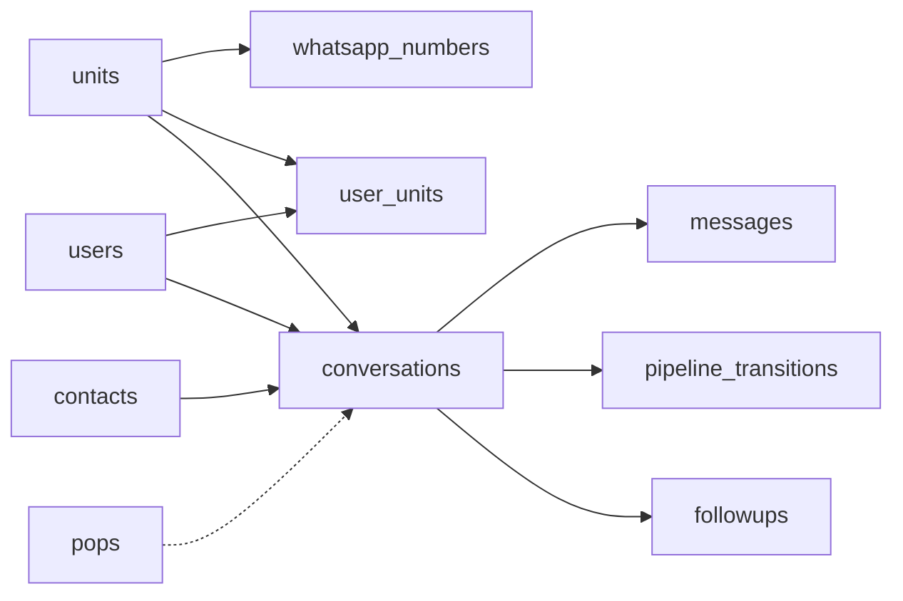
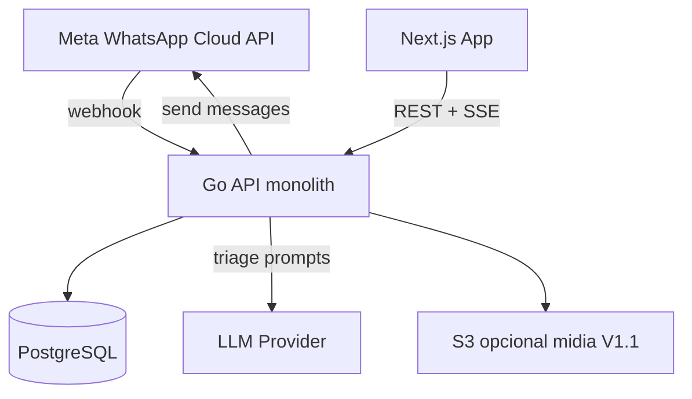
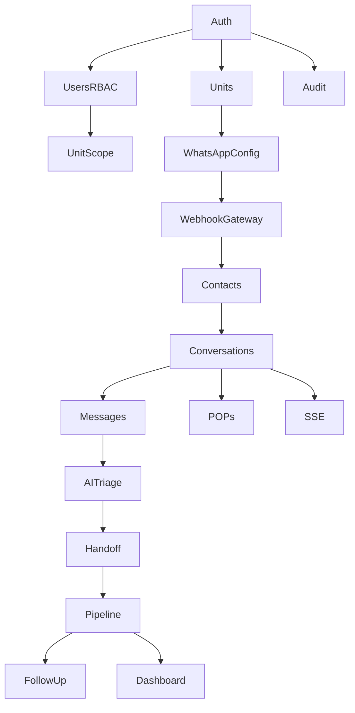

# CRM Cia da Vacina — Especificação Técnica (Spec-Kit)

> **Status:** APROVADO para implementação (Sprint 1+)  
> **Data de aprovação:** 2026-07-14  
> **Canal MVP:** WhatsApp Meta Cloud API  
> **IA MVP:** Triagem inicial + handoff humano  
> **Equipe:** Felipe (Backend/Go) · Cristian (Frontend/Next.js)

---

# CRM Cia da Vacina — Especificação Técnica (Spec-Kit)

**Decisões fechadas com o stakeholder**
- Canal MVP: **somente WhatsApp** via **Meta Cloud API**
- IA MVP: **triagem inicial** (saudação, identificação de necessidade, roteamento) + **handoff humano obrigatório**
- Equipe: Felipe (backend/Go/DB/APIs) + Cristian (frontend/Next.js)
- Unidade de negócio: **5 unidades** Cia da Vacina

**Regra:** tudo não citado pelo usuário e não decidido acima está marcado como **SUPOSIÇÃO**.

---

# ETAPA 1 — COMPREENSÃO

## Objetivos de negócio
1. Centralizar atendimento WhatsApp das 5 unidades em uma única plataforma.
2. Padronizar respostas com base nos POPs da Cia da Vacina.
3. Acelerar o primeiro contato via IA de triagem, sem perder humanização.
4. Dar visibilidade do funil comercial (etapa do cliente).
5. Reduzir passividade pós-atendimento (follow-up de “não fechado” / “aguardando fechamento”).
6. Medir produtividade e conversão por unidade.
7. Aumentar taxa de conversão dos atendimentos.

## Problemas que o sistema resolve
1. Conversas dispersas no WhatsApp (sem controle central).
2. Atendimento não padronizado entre profissionais/unidades.
3. Falta de visão de status comercial do lead.
4. Perda de oportunidades sem follow-up.
5. Dificuldade de comparar desempenho entre unidades.
6. Retrabalho e atraso na identificação da necessidade do cliente.
7. Assunção manual “no escuro” sem histórico consolidado.

## Atores do sistema
- **Cliente** (usuário externo no WhatsApp)
- **IA de Triagem** (bot inicial)
- **Atendente** (responde e move pipeline)
- **Supervisor** (fila, redistribuição, qualidade)
- **Gerente de Unidade** (visão da unidade + conversão)
- **Administrador** (usuários, unidades, configs, POPs, integrações)
- **Sistema** (webhooks, jobs de follow-up, auditoria)

### SUPOSIÇÃO (papéis)
Roles RBAC acima; Stakeholder não listou hierarquia — modelado para operação multiunidade típica.

## Requisitos Funcionais

| ID | Nome | Descrição | Prioridade | Dependências |
|---|---|---|---|---|
| RF-001 | Autenticação | Login seguro com sessão/JWT e logout | Must | — |
| RF-002 | Gestão de usuários | CRUD usuários, logout forçado, ativar/desativar | Must | RF-001 |
| RF-003 | Permissões RBAC | Papéis: Admin, Gerente, Supervisor, Atendente | Must | RF-002 |
| RF-004 | Unidades | Cadastro/gestão das 5 unidades | Must | RF-002 |
| RF-005 | Vínculo usuário×unidade | Usuário opera em 1+ unidades (escopo de dados) | Must | RF-003, RF-004 |
| RF-006 | Inbox WhatsApp | Lista conversas ativas/histórico por unidade/fila | Must | RF-010, RF-005 |
| RF-007 | Thread de mensagens | Enviar/receber texto; ordenação cronológica; status entrega | Must | RF-006 |
| RF-008 | Webhook WhatsApp | Receber eventos Meta Cloud API (mensagem, status) | Must | — |
| RF-009 | Envio WhatsApp | Enviar mensagens via Graph API com sessão/template | Must | RF-008 |
| RF-010 | Contatos/Clientes | Identificar contato por telefone; enriquecer perfil | Must | RF-008 |
| RF-011 | IA triagem | Saudação + classificação de intenção + resumo + roteamento | Must | RF-007, RF-012 |
| RF-012 | Handoff humano | Atendente assume; IA para; histórico preservado | Must | RF-011, RF-006 |
| RF-013 | Atribuição | Auto/manual assign para atendente/unidade | Must | RF-005, RF-012 |
| RF-014 | Pipeline comercial | Etapas: Em atendimento; Em negociação; Aguardando fechamento; Fechado; Não fechado | Must | RF-006 |
| RF-015 | Transição de etapa | Mover conversa/oportunidade com motivo (obrigatório em Não fechado) | Must | RF-014 |
| RF-016 | Motivo de não conversão | Catálogo + texto livre; base para estratégia | Must | RF-015 |
| RF-017 | Follow-up | Lista “retomar” (Aguardando fechamento / Não fechado) + lembretes | Must | RF-014, RF-016 |
| RF-018 | POPs / scripts | Biblioteca de procedimentos e respostas padrão por intenção | Must | RF-003 |
| RF-019 | Inserir POP na conversa | Atendente aplica snippet/POP no composer | Should | RF-018, RF-007 |
| RF-020 | Dashboard unidade | Atendimentos abertos, por etapa, conversão, SLA simples | Must | RF-014 |
| RF-021 | Dashboard consolidado | Visão Admin/Gerente das 5 unidades | Must | RF-020 |
| RF-022 | Produtividade | Mensagens/atendimentos por atendente/unidade (período) | Should | RF-007, RF-013 |
| RF-023 | Auditoria | Log de ações críticas (handoff, etapa, assign, envio) | Must | RF-001 |
| RF-024 | Configurações | Tokens Meta, WABA, número, flags IA, horários | Must | RF-003 |
| RF-025 | Busca | Buscar conversas/contatos por nome/telefone | Should | RF-006, RF-010 |
| RF-026 | Notificações in-app | Novo msg / menção / lembrete follow-up | Should | RF-007 |
| RF-027 | Templates WhatsApp | Envio fora da janela 24h via templates aprovados | Must | RF-009 |
| RF-028 | Encerrar conversa | Resolver/arquivar mantendo histórico | Should | RF-014 |

### Fora do MVP (explicitamente)
- Instagram/Facebook/outros canais
- IA conversacional contínua
- Discador, e-mail, SMS
- BI avançado / exportações complexas

## Requisitos Não Funcionais
- **Performance:** Inbox inicial < 2s (p95) com 5 unidades; envio msg < 1s API local (excluindo Meta).
- **Segurança:** HTTPS, secrets em env/vault, least privilege, isolamento por unidade.
- **Escalabilidade:** 5 unidades, dezenas de atendentes; crescimento orgânico sem redesign (1 app Go + Postgres).
- **Disponibilidade:** alvo **99%** comercial; webhook retry da Meta tratado idempotentemente.
- **Auditoria:** ações sensíveis imutáveis (append-only).
- **LGPD:** base legal atendimento; retenção configurável; acesso por papel; não treinar modelo externo com PII sem consentimento — **SUPOSIÇÃO:** política de retenção 24 meses.
- **Observabilidade:** logs estruturados + health + métricas básicas (requests, errors, webhook lag).
- **Logs:** correlação `request_id` / `conversation_id`.
- **Backup:** Postgres diário + retenção 7–30 dias — **SUPOSIÇÃO** hosting Cloud (ex.: Managed Postgres).

## Restrições
1. Apenas 2 desenvolvedores (Felipe + Cristian).
2. Stack: Go + Next.js + React + TypeScript.
3. Canal MVP = WhatsApp Meta Cloud API apenas.
4. IA = triagem + handoff (não substitui atendente).
5. Evitar overengineering (sem microserviços, sem Kafka no MVP).
6. POPs da Cia da Vacina devem orientar atendimento (conteúdo a fornecer pelo negócio).

## Suposições
1. **SUPOSIÇÃO:** 1 número WhatsApp Business por unidade OU um hub com roteamento — *default adoptado:* **1 WABA com N números (1 por unidade)** se disponível; senão 1 número + tag de unidade na triagem.
2. **SUPOSIÇÃO:** Autenticação email/senha (sem SSO corporativo).
3. **SUPOSIÇÃO:** LLM via API (OpenAI/Azure OpenAI/Anthropic) com prompts internos; fallback para menu de intenções se LLM falhar.
4. **SUPOSIÇÃO:** Tempo real via **SSE** (mais simples que WebSocket) para inbox.
5. **SUPOSIÇÃO:** Storage de mídia WhatsApp em object storage (S3-compatible) só se mídia for Must; **MVP texto-first**, mídia fase V1.1.
6. **SUPOSIÇÃO:** Horário comercial brasileiro (America/Sao_Paulo).
7. **SUPOSIÇÃO:** Deploy único (API + web) em cloud com Postgres gerenciado.

## Dúvidas em aberto (não bloqueiam o plano; mudam estimativa)
1. 1 número por unidade ou número único?
2. Qual provedor LLM e se há DPA/LGPD já aprovado?
3. Conteúdo oficial dos POPs (quando disponível)?
4. SLA de primeira resposta alvo?
5. Precisa integração com agenda/prontuário/sistema de vacinas existente?
6. Quem define catálogo de motivos de não conversão?
7. Volume estimado msgs/dia?
8. Hospedagem preferida (AWS, GCP, Azure, VPS)?

---

# ETAPA 2 — ENGENHARIA REVERSA (MÓDULOS)

| Módulo | Objetivo | Funcionalidades | Dependências | Prioridade | Impacto |
|---|---|---|---|---|---|
| Auth | Acesso seguro | Login, JWT, refresh, logout | — | P0 | Bloqueia tudo |
| Users & RBAC | Controle acesso | CRUD user, roles, escopo unidade | Auth | P0 | Segurança multiunidade |
| Units | Multiunidade | CRUD 5 unidades | Auth | P0 | Isolamento de dados |
| WhatsApp Gateway | Entrada/saída msgs | Webhook, send, templates, statuses | Config | P0 | Coração do produto |
| Contacts | Identidade do cliente | Upsert por phone, perfil | Gateway | P0 | Histórico único |
| Conversations/Inbox | Atendimento | Lista, thread, assign, status | Contacts | P0 | Operação diária |
| AI Triage | Primeiro contato inteligente | Prompt POP-aware, intent, roteamento | Conversations | P0 | Agilidade + padrão |
| Handoff | Humanização | Assume, pause IA, ownership | AI + Inbox | P0 | Qualidade |
| Pipeline CRM | Funil comercial | Etapas, motivos, histórico | Conversations | P0 | Conversão |
| Follow-up | Retomada | Fila, lembretes | Pipeline | P1 | Reduz passividade |
| POPs | Padronização | Cadastro, busca, insert | Auth | P1 | Qualidade |
| Dashboard | Gestão | KPIs unidade/consolidado | Pipeline | P1 | Visibilidade gerencial |
| Audit | Compliance | Event log | Auth | P1 | LGPD/rastreio |
| Config | Operação | Meta tokens, IA flags | Auth | P0 | Go-live |
| Notifications | UX tempo real | SSE eventos | Inbox | P1 | Agilidade |

---

# ETAPA 3 — USER STORIES (principais)

### US-01 Login
**Como** Atendente **quero** autenticar **para** acessar o inbox com segurança.  
**ACEITE:** credenciais válidas → token; inválidas → erro; usuário inativo bloqueado.  
**Fluxo:** form → API login → cookie/token → redirect `/inbox`.  
**Alt:** senha errada; usuário desativado.  
**Erros:** 401/403.  
**RN:** senha hashed (bcrypt/argon2); sessão com expiração.

### US-02 Receber mensagem WhatsApp
**Como** Sistema **quero** ingressar mensagem Meta **para** abrir/atualizar conversa.  
**ACEITE:** webhook verificado; idempotência por `wamid`; cria contato/conversa; dispara IA se estado=triagem.  
**RN:** isolamento por número/unidade.

### US-03 Triagem IA
**Como** Cliente **quero** ser saudado e direcionado **para** falar com quem resolve.  
**ACEITE:** IA responde saudação; classifica intenção (ex.: agendar, preços, dúvidas, reclamação — **SUPOSIÇÃO catálogo**); sugere unidade; cria resumo; coloca em fila humana.  
**Alt:** falha LLM → mensagem fallback + fila humano.  
**RN:** máx N turnos IA (**SUPOSIÇÃO:** 3) ou handoff automático se intent claro / pedido humano.

### US-04 Assumir conversa
**Como** Atendente **quero** assumir **para** continuar atendimento humanizado.  
**ACEITE:** ownership muda; IA desligada; evento auditado; POP sugerido por intent.

### US-05 Enviar mensagem
**Como** Atendente **quero** responder no WhatsApp **para** avançar a venda.  
**ACEITE:** dentro 24h free-form; fora 24h só template; status sent/delivered/read refletidos.

### US-06 Mover pipeline
**Como** Atendente **quero** mudar etapa **para** refletir negociação.  
**ACEITE:** etapas válidas; “Não fechado” exige motivo; histórico de transição.

### US-07 Follow-up
**Como** Supervisor **quero** lista de clientes em aberto/não fechado **para** retomar e converter.  
**ACEITE:** filtros por unidade/etapa/motivo; registrar tentativa de retorno.

### US-08 Dashboard
**Como** Gerente **quero** ver desempenho da unidade **para** gerir conversão.  
**ACEITE:** contadores por etapa; % fechado; atendimentos abertos; período filtrável.

### US-09 POPs
**Como** Atendente **quero** inserir script POP **para** padronizar.  
**ACEITE:** busca por tag/intent; insert no composer editável antes do envio.

### US-10 Admin config Meta
**Como** Admin **quero** configurar WABA/token/número **para** operação.  
**ACEITE:** secrets mascarados; teste de webhook; e2e send test.

*(Demais stories derivadas no backlog — Etapa 9)*

---

# ETAPA 4 — CASOS DE USO (amostra canônica + padrão)

### CU-03 Triagem IA
- **Pré:** webhook ok; conversa `state=ai_triage`; prompt/POP carregados.
- **Principal:** msg cliente → IA → reply WhatsApp → atualiza intent/resumo → se critérios handoff → fila.
- **Alt:** timeout LLM; conteúdo ofensivo; cliente pede humano.
- **Pós:** conversa com intent; aguardando atendente OU ainda em triagem.

### CU-04 Handoff
- **Pré:** conversa em fila/triage; atendente autenticado com escopo unidade.
- **Principal:** claim → ownership → stop IA → notifica UI.
- **Alt:** já atribuída a outro (conflito → 409).
- **Pós:** `owner_id` set; `mode=human`.

### CU-06 Pipeline
- **Pré:** conversa sob ownership ou papel supervisor.
- **Principal:** seleciona etapa → valida → pede motivo se Não fechado → grava transição.
- **Pós:** etapa atual + audit trail.

*(Aplicar o mesmo esqueleto Pré/Principal/Alt/Pós a US-01…US-10 na implementação.)*

---

# ETAPA 5 — MODELO DE DADOS

**Entidades principais (Postgres)**

- **users:** id, email, password_hash, name, role(`admin|manager|supervisor|agent`), active, created_at
- **units:** id, name, code, timezone, active
- **user_units:** user_id, unit_id (PK composta)
- **whatsapp_numbers:** id, unit_id, phone_number_id, display_phone, waba_id, active
- **contacts:** id, wa_id, phone_e164, name, unit_id?, created_at; **UNIQUE(wa_id)**
- **conversations:** id, contact_id, unit_id, status(`open|pending|resolved`), mode(`ai_triage|human`), owner_id?, pipeline_stage, intent?, ai_summary?, last_message_at, window_expires_at
- **messages:** id, conversation_id, direction(`in|out`), sender_type(`contact|agent|ai|system`), body, wa_message_id UNIQUE, status(`accepted|sent|delivered|read|failed`), created_at
- **pipeline_transitions:** id, conversation_id, from_stage, to_stage, reason_code?, reason_text?, by_user_id, created_at
- **loss_reasons:** id, code, label, active
- **pops:** id, title, body, intent_tags[], unit_id nullable, active
- **followups:** id, conversation_id, due_at, status(`open|done|canceled`), note, created_by
- **ai_runs:** id, conversation_id, model, prompt_version, input_ref, output_json, latency_ms, error?
- **audit_logs:** id, actor_user_id?, action, entity_type, entity_id, payload_json, ip?, created_at
- **message_templates:** id, name, language, status, body_preview, meta_template_name
- **configs:** key, value_encrypted?, updated_by, updated_at

**Índices:** `conversations(unit_id, status, last_message_at DESC)`; `messages(conversation_id, created_at)`; `contacts(phone_e164)`; `followups(status, due_at)`; `audit_logs(created_at)`.

**Restrições:** FKs; enum stages exatamente as 5 etapas; motivo obrigatório se `to_stage=nao_fechado`.

---

# ETAPA 6 — APIs (contrato inicial)

Base: `/api/v1` — Auth Bearer JWT — erros `{code,message,details}`

| Método | Endpoint | Permissão | Notas |
|---|---|---|---|
| POST | `/auth/login` | public | → tokens |
| POST | `/auth/logout` | auth | |
| GET | `/me` | auth | perfil + units |
| CRUD | `/users` | admin | |
| CRUD | `/units` | admin | |
| GET | `/inbox?unit_id&stage&owner` | agent+ | lista conversas |
| GET | `/conversations/{id}` | scoped | detalhe |
| GET | `/conversations/{id}/messages` | scoped | paginado cursor |
| POST | `/conversations/{id}/messages` | owner/supervisor | envia WhatsApp |
| POST | `/conversations/{id}/claim` | agent+ | handoff |
| POST | `/conversations/{id}/assign` | supervisor+ | |
| PATCH | `/conversations/{id}/pipeline` | agent+ | body stage+reason |
| GET/POST | `/followups` | agent+ | |
| CRUD | `/pops` | admin/supervisor write | |
| GET | `/dashboard/summary` | manager+ | KPIs |
| GET | `/sse/events` | auth | tempo real |
| GET/POST | `/webhooks/whatsapp` | Meta | verify + ingress |
| GET/PUT | `/settings/whatsapp` | admin | |
| GET | `/loss-reasons` | auth | |

**Erros HTTP:** 400 validação; 401/403; 404; 409 claim conflito; 422 regra negócio (fora janela sem template); 429; 502 Meta upstream.

---

# ETAPA 7 — ARQUITETURA (simples, 2 devs)

**Decisões**
- **Go monólito modular** (package por domínio): 1 deploy, 1 DB — adequado a 2 pessoas.
- **Next.js App Router**: BFF mínimo; preferir chamar API Go direto (cookies/JWT).
- **Postgres:** fonte da verdade; sem sharding.
- **Cache:** sem Redis no MVP; cache em memória só para JWKS/config TTL curto se precisar.
- **Mensageria:** **não** no MVP — webhook processado síncrono + fila DB (`jobs` table) se retry simples.
- **Tempo real:** **SSE** (menos ops que WS).
- **Workers:** goroutine/cron no mesmo binário para follow-ups e retries Meta.

**Por quê:** menor ops, menos falhas de integração interna, entrega mais rápida.

---

# ETAPA 8 — ANÁLISE TRIPLA (por módulo — síntese)

Escala: Valor / Complexidade / Tempo / Benefício / Manutenção / Escala / Risco (0–10) → veredito.

| Módulo | A Negativos | B Positivos | Notas médias | Veredito |
|---|---|---|---|---|
| Auth/RBAC/Units | Escopo multiunidade errado = vazamento | Base sólida reuso | V9 C5 T5 B9 M8 E7 R5 | **Vale Muito** |
| WhatsApp Gateway | API Meta volátil; templates; 24h window | Canal único real do negócio | V10 C8 T8 B10 M6 E7 R8 | **Vale Muito** (atenção risco) |
| Inbox/Msgs | Tempo real + estados | Core do produto | V10 C7 T7 B10 M7 E7 R6 | **Vale Muito** |
| AI Triage | Custo LLM; alucinação; LGPD | Padroniza + agiliza entrada | V8 C7 T6 B8 M6 E7 R7 | **Vale a Pena** (MVP limitado) |
| Handoff | Concorrência claim | Humaniza; reduz frustração | V9 C4 T3 B9 M8 E8 R3 | **Vale Muito** |
| Pipeline+Motivos | Disciplina de uso humano | Controle conversão | V10 C4 T4 B10 M8 E8 R3 | **Vale Muito** |
| Follow-up | Spam/WhatsApp policy | Combate passividade | V8 C4 T4 B8 M7 E7 R4 | **Vale a Pena** |
| POPs | Conteúdo depende do negócio | Padronização baixa tech | V7 C2 T3 B7 M9 E8 R2 | **Vale a Pena** |
| Dashboard | Pode virar BI infinito | Gestão unidades | V8 C4 T4 B8 M7 E6 R3 | **Vale a Pena** (KPIs mínimos) |
| Audit/Config | Fácil descuidar | Compliance + go-live | V7 C3 T3 B7 M8 E7 R3 | **Vale a Pena** |
| Notificações SSE | Conexões idle | Produtividade inbox | V7 C4 T3 B7 M7 E6 R4 | **Vale a Pena** |

**Corte Tech Lead:** sem omnichannel, sem microserviços, sem IA contínua, dashboard só 5–7 KPIs.

---

# ETAPA 9 — BACKLOG (tarefas 4–12h)

Convenção: **BE** Felipe / **FE** Cristian | Estimativa em horas | P0→P2

### Fundação
- T-001 BE Setup Go module, config, health, logging estruturado — 6h P0
- T-002 BE Postgres schema base (users, units, user_units) + migrate tool — 8h P0
- T-003 BE Auth login/JWT/refresh/middleware RBAC — 10h P0
- T-004 BE CRUD users/units + assign units — 10h P0
- T-005 FE App shell Next.js, auth pages, guard routes — 10h P0
- T-006 FE Layout app (nav, unit switcher) + design tokens — 8h P0
- T-007 Ambos OpenAPI/contrato v0 + mocks MSW — 8h P0

### WhatsApp + Domínio conversas
- T-010 BE Webhook verify + ingest idempotente — 10h P0
- T-011 BE Models contacts/conversations/messages + repos — 10h P0
- T-012 BE Send text Graph API + status updates — 10h P0
- T-013 BE Templates send (fora janela) — 8h P0
- T-014 BE Inbox query filters + pagination — 8h P0
- T-015 FE Inbox list + conversation thread UI — 12h P0
- T-016 FE Composer send + estados loading/error/window 24h — 10h P0
- T-017 BE Settings WhatsApp admin API — 6h P0
- T-018 FE Settings WhatsApp (mascarar secrets) — 6h P0

### IA + Handoff
- T-020 BE AI triage service (prompt, intent, summary, max turns) — 12h P0
- T-021 BE Fallback sem LLM + flags config — 6h P0
- T-022 BE Claim/assign/handoff + conflitos 409 — 8h P0
- T-023 FE Banner modo IA/humano + botão Assumir — 6h P0
- T-024 FE Painel intent/resumo IA — 6h P0

### Pipeline + Follow-up
- T-030 BE Pipeline patch + transitions + loss reasons — 8h P0
- T-031 FE Stage selector + motivo modal — 8h P0
- T-032 BE Follow-ups CRUD + job due — 8h P1
- T-033 FE Fila follow-up + filtros — 8h P1

### POPs + Dashboard + Audit + Realtime
- T-040 BE/FE POPs CRUD + insert composer — 8h+8h P1
- T-041 BE Dashboard summary SQL — 8h P1
- T-042 FE Dashboard unidade + consolidado — 10h P1
- T-043 BE Audit log writer + list admin — 6h P1
- T-044 BE SSE events + FE subscribe — 8h+8h P1
- T-045 BE/FE Busca contatos/conversas — 6h+6h P2
- T-046 QA e2e checklist WhatsApp sandbox — 8h P0 (compartilhado)
- T-047 Hardening LGPD/retention + backups doc — 6h P1

---

# ETAPA 10 — DIVISÃO DA EQUIPE

## Backend (Felipe) — pacotes
- **Models/Repos:** users, units, contacts, conversations, messages, pipeline, pops, followups, audit, configs
- **Repositories:** SQLC ou pgx
- **Services/Use cases:** Auth, WhatsAppIngress, WhatsAppEgress, AITriage, ClaimConversation, UpdatePipeline, Dashboard, FollowUpScheduler
- **Middlewares:** auth, rbac, unit-scope, request-id, recover
- **Endpoints:** lista Etapa 6
- **Validações:** go-playground/validator; regras janela 24h; motivo obrigatório
- **Integrações:** Meta Graph, LLM
- **Workers:** retry send; follow-up due notifier
- **Testes:** unit services + integration webhook idempotency
- **Docs:** OpenAPI
- **Tempo individual agregado:** ~**160–190h**

## Frontend (Cristian)
- **Páginas:** login, inbox, conversation, follow-ups, dashboard, pops, users/admin, settings
- **Layouts:** auth / app / admin
- **Componentes:** ConversationList, Thread, Composer, StageBadge, ClaimButton, PopPicker, KpiCards, UnitSwitcher
- **Hooks:** useInbox, useConversation, useSSE, useAuth
- **State:** server-state TanStack Query; UI state mínimo (Zustand opcional só filtros)
- **APIs:** client tipado do OpenAPI
- **Forms/validação:** React Hook Form + Zod
- **Loading/erros/empty/responsive:** obrigatório em inbox/dashboard
- **Testes:** Testing Library fluxos claim/send/pipeline
- **Tempo individual agregado:** ~**130–160h**

---

# ETAPA 11 — PARALELISMO

- **Front pode começar?** Sim, **Dia 1** com mocks após T-007.
- **Mocks?** Sim (MSW) para inbox, messages, claim, pipeline, dashboard.
- **Contratos primeiros:** Auth, Inbox list, Messages, Claim, Pipeline patch, SSE event shape, WhatsApp settings.
- **Endpoints que desbloqueiam FE:** `login`, `GET /inbox`, `GET messages`, `POST messages`, `POST claim`, `PATCH pipeline`.
- **Paralelo:** FE shell+inbox mock || BE schema+auth+webhook.
- **Bloqueios:** go-live WhatsApp real bloqueia validação e2e; IA precisa de chave LLM; POPs conteúdo negócio.

---

# ETAPA 12 — ÁRVORE DE DEPENDÊNCIAS

---

# ETAPA 13 — ROADMAP (ordem anti-retrabalho)

1. Contratos OpenAPI + Auth + Units + RBAC  
2. WhatsApp webhook/send (sandbox) + Contacts/Conversations/Messages  
3. Inbox FE conectado  
4. Claim/Handoff  
5. Pipeline + motivos  
6. IA triagem (com kill-switch)  
7. Templates 24h  
8. SSE  
9. Follow-up  
10. POPs  
11. Dashboard  
12. Audit + hardening + go-live checklist  

**Por quê:** UI e domínio de conversa estabilizam cedo; IA/dashboard depois para não invalidar contratos.

---

# ETAPA 14 — CRONOGRAMA

### Tabela resumo (horas)

| Funcionalidade | BE | FE | Deps | Complex. | h BE | h FE | Paralelo | Total calendar* |
|---|---|---|---|---|---|---|---|---|
| Fundação Auth/Units | Felipe | Cristian | — | M | 34 | 26 | Sim | ~1.5 sem |
| WhatsApp+Inbox | Felipe | Cristian | Fundação | A | 54 | 28 | Parcial | ~2.5 sem |
| Handoff+Pipeline | Felipe | Cristian | Inbox | M | 16 | 14 | Sim | ~1 sem |
| IA Triagem | Felipe | Cristian | Msg+Handoff | A | 18 | 12 | Parcial | ~1 sem |
| Templates+Settings | Felipe | Cristian | WhatsApp | M | 14 | 6 | Sim | ~0.5 sem |
| Follow-up | Felipe | Cristian | Pipeline | B | 8 | 8 | Sim | ~0.5 sem |
| POPs | Felipe | Cristian | Inbox | B | 8 | 8 | Sim | ~0.5 sem |
| Dashboard+SSE+Audit | Felipe | Cristian | Pipeline | M | 22 | 26 | Sim | ~1.5 sem |
| QA/Hardening | ambos | ambos | tudo P0 | M | 10 | 10 | Sim | ~0.5 sem |

\*Total calendar assume ~6h produtivas/dia/dev.

**Agregado:** BE ~**184h** | FE ~**138h** | Bruto ~**322h**  
**Paralelo 2 devs:** ~**190–210h** de calendário de equipe ≈ **8–10 semanas** (5 dias/sem × ~6h) com folga de risco Meta/LLM.

### Por semanas (MVP)
- S1: contratos, auth, units, shell FE  
- S2–S3: webhook, messages, inbox real  
- S4: claim + pipeline + motivos  
- S5: IA triagem + fallback  
- S6: templates + settings + SSE  
- S7: follow-up + POPs  
- S8: dashboard + audit + hardening  
- S9–S10: buffer integração Meta, UAT, ajustes POP/negócio  

### Sprints (2 semanas)
- Sprint 1: Fundação + início WhatsApp  
- Sprint 2: Inbox + send/receive estáveis  
- Sprint 3: Handoff + Pipeline + IA  
- Sprint 4: Templates + Follow-up + POPs + Dashboard  
- Sprint 5 (buffer): UAT + go-live  

### Marcos
- M1: Login + multiunidade  
- M2: WhatsApp e2e sandbox  
- M3: Operação humana completa (inbox+pipeline)  
- M4: IA triagem com kill-switch  
- M5: Gestão (dashboard+follow-up)  
- M6: Produção

---

# ETAPA 15 — MVP

**Indispensável (MVP)**  
Auth/RBAC/Units, WhatsApp in/out, Inbox, IA triagem+handoff, Pipeline+motivos, Templates 24h, Dashboard mínimo, Audit básico, Settings Meta.

**Pode esperar (pós-MVP imediato)**  
Mídia rica, busca avançada, notificações push mobile, produtividade detalhada.

**V2**  
Instagram/Messenger, IA assistindo sugestões durante humano, automações de campanha, BI export, SSO, app mobile, CSAT.

**Maior valor rápido**  
Inbox+pipeline+motivos (mesmo sem IA) já elimina passividade; IA é acelerador do primeiro contato.

---

# ETAPA 16 — ANÁLISE CRÍTICA

- **Duplicados:** “controle conversas” e “pipeline” — unificar em Conversation+stage (sem entidade Deal separada no MVP) → **simplicidade**.
- **Desnecessário agora:** omnichannel, microserviços, Redis, Kafka, app nativo.
- **Inconsistência potencial:** 1 número vs 5 — precisa fechar antes do go-live.
- **Riscos:** aprovação templates Meta; política 24h; custo LLM; adoção do time no preenchimento de etapas.
- **Gargalo:** Felipe no Gateway Meta (caminho crítico).
- **Simplificação:** 1 tabela `conversations.pipeline_stage` em vez de CRM deals paralelo.
- **Reuso:** mesmo componente de filtros unidade no Inbox/Dashboard/Follow-up.

---

# ETAPA 17 — TECH LEAD REVIEW

- **Removeria:** canais sociais; IA contínua; BI rico; microserviços; Redis obrigatório.
- **Simplificaria:** Deal=Conversation; SSE não WS; jobs em tabela Postgres.
- **Faria diferente:** fechar contrato OpenAPI no dia 1; WhatsApp sandbox na semana 2; IA atrás de feature flag.
- **Overengineering:** multi-tenant genérico SaaS — aqui é single-tenant Cia da Vacina + 5 units.
- **Risco atraso:** Meta (templates/webhook), conteúdo POP, indefinição de números.
- **Felipe bloqueado:** credenciais WABA; provider LLM; regras de roteamento unidade.
- **Cristian bloqueado:** contrato inbox/messages; decision SSE payload.
- **-30% tempo:** cortar dashboard elaborado + POPs CRUD rico (começam markdown seed) + adiar follow-up job para lista manual + IA fase logo após handoff humano estável.
- **Qualidade sem alongar:** contract tests; checklist e2e WhatsApp; feature flags; code review cruzado só em Gateway/Auth/Pipeline.

---

# ETAPA 18 — CONCLUSÃO

1. **Resumo executivo:** CRM interno para centralizar WhatsApp das 5 unidades, triagem por IA, handoff humano, funil comercial e gestão de conversão — stack simples Go + Next.js + Postgres.  
2. **Escopo final MVP:** auth multiunidade, WhatsApp Meta, inbox, IA triagem, handoff, pipeline 5 etapas + motivos, templates, follow-up básico, POPs, dashboard mínimo, audit.  
3. **Arquitetura:** monólito Go + Next.js + Postgres + SSE + LLM API; sem broker.  
4. **Backlog:** tarefas T-001…T-047 (4–12h).  
5. **Roadmap:** fundação → WhatsApp → inbox → handoff/pipeline → IA → templates/SSE → follow-up/POPs → dashboard → go-live.  
6. **Cronograma:** 8–10 semanas com buffer.  
7. **Estimativa BE:** ~184h  
8. **Estimativa FE:** ~138h  
9. **Estimativa total esforço:** ~322h  
10. **Em dias (1 pessoa):** ~54 dias úteis @6h  
11. **Em paralelo (2 pessoas):** ~**9 semanas** (+1 buffer)  
12. **Caminho crítico:** Meta WhatsApp Gateway → Messages → Inbox → Handoff → Pipeline → (IA) → Go-live  
13. **Riscos:** Meta templates/janela 24h; adoção pipeline; LLM/LGPD; 1 vs N números  
14. **Mitigação:** sandbox cedo; feature flags; motivos obrigatórios UX; fallback sem IA; workshop POPs  
15. **MVP:** operação humana + funil (+ IA triagem)  
16. **V2:** omnichannel, IA copiloto, automações, BI  
17. **Confiança estimativa:** **65%**  

**Fatores que alteram forte a estimativa:** atraso WABA/templates; mídia obrigatória no MVP; SSO; integração com sistema clínico/agenda; volume muito alto exigindo fila real; mudança para omnichannel.

---

## Artefatos sugeridos no repo (após aprovação; sem código agora)
- `docs/spec.md` — este documento
- `docs/openapi.yaml` — contrato
- `docs/data-model.md` — entidades
- `docs/backlog.csv` — T-IDs
- `docs/adr/0001-simple-monolith.md`

